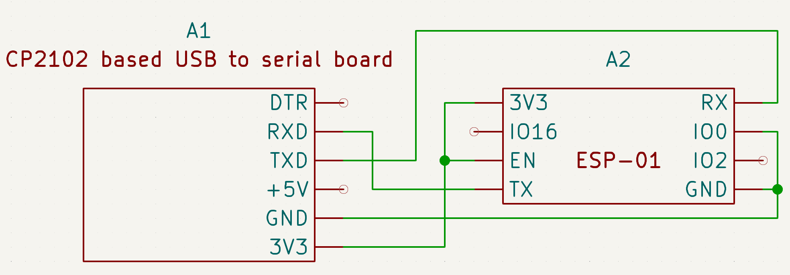
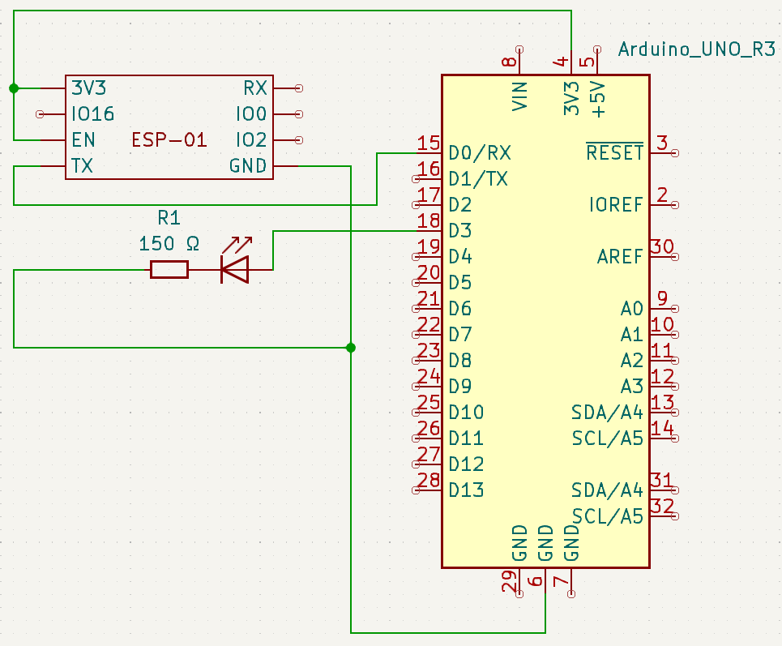

# remote-ac-remote
Controlling air-con through the web.

## Web app
Uses Flask, SocketIO for the web side.

## Microcontroller
Uses a ESP-01 (ESP8266 chip) to connect to the Flask web app, then sends the required data to an Arduino to control the air conditioner.


# Get started running

## IR codes
The IR codes in this repo are for my LG air conditioner, other air conditioners may have different IR codes.
You can find the IR codes of your remote control with ir-checker.ino with the circuit:

You could also use other microcontrollers, such as the ESP32.


## Testing the web app
Ideally, you should use a python virtual environment.
To run Gunicorn, a UNIX-based or UNIX-like OS is required. Virtual environment running Linux could be used to run Gunicorn if on Windows.
Create one with `python -m venv remote` within the web-app directory.
Activate it `. remote/bin/activate`.

pip install the items in requirements.txt `pip install -r requirements.txt`.

Run the flask server using the Gunicorn WSGI server.
```gunicorn --worker-class eventlet -w 1 --log-level debug --bind 0.0.0.0:5000 app:app```

Test the flask server by going to the ip address of the server at port 5000, for example localhost:5000.
You should be sent to the login page. If you have not changed the .env file, you can log in with user `remoteremote` and password `Password123`.

The password can be changed by running the following code in the virtual environment (Example: changing password to 123Password):
```
>>> from argon2 import PasswordHasher
>>> ph = PasswordHasher(time_cost=3, memory_cost=1048576, parallelism=4)  # Use the same parameters in app.py
>>> print(ph.hash('123Password'))
'$argon2id$v=19$m=1048576,t=3,p=4$Rde2Ibsd+Ud+/2RSwHjIJg$iYMtP6hlAgVPZYDl8g7b3RpKsE8YMZyyvxiR/gwHJMI'
```
Then copy the password hash and replace RR_PASS in the .env file, then restart Gunicorn.

Open the website using another browser, mode or device and log in again. 
Change the status of the remote and the same status should show on the other instance.


## Wiring up the ESP-01 and uploading the ESP-01 codes
Connect the ESP-01 to the computer. I connected my ESP-01 to a CP2102-based USB to Serial board.

RX (USB to Serial) to TX (ESP-01)
TX (USB to Serial) to RX (ESP-01)
GND (USB to Serial) to GND and IO0 (ESP-01)
3V3 (USB to Serial) to 3V3 and EN (ESP-01)

Use TLS code if the server uses TLS, and use the debug version to check if you can connect and receive the right info.
Update the code with the token from .env(if changed), your WiFi details, and your server ip address and port, under:
```
#define RR_TOKEN "token=abcdefghijklmnopqrstuvwxyz"
#define WIFI_SSID ""
#define WIFI_PASS ""
#define SOCKET_HOST "192.168.1.0"
#define SOCKET_PORT 5000
#define SOCKET_PORT_STR "5000"
```
Upload code using the Arduino IDE or other IDE to the ESP-01.
You should see `Leaving... Hard resetting via RTS pin...` if the code is done uploading.
Disconnect IO0 from ESP-01 to exit code uploading mode and then remove power from the ESP-01 and power it again.

Use non-debug version if details are finalised and upload to the ESP-01.


## Uploading code to Arduino
Connect USB from computer directly to the Arduino Uno.
Upload arduino code.


# Final touches

## Wiring everything together
We can now wire everything up when we have tested everything to be working.

I'm using a 5mm IR LED and a 150 ohm resistor would be sufficient, albeit not having great range. 
