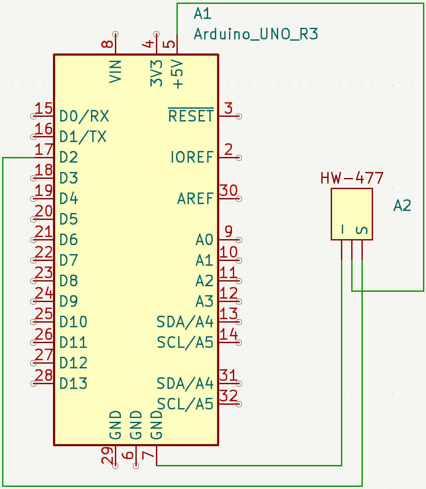

# remote-ac-remote
Controlling air-con through the web.

## Web app
Uses Flask, SocketIO for the web side.

## Microcontroller
Uses a ESP-01 (ESP8266 chip) to connect to the Flask web app, then sends the required data to an Arduino to control the air conditioner.

# Get started running

## IR codes
The IR codes in this repo are for my LG air conditioner, other air conditioners may have different IR codes.
You can find the IR codes of your remote control with ir-checker.ino with the circuit:

You could also use other microcontrollers, such as the ESP32.

## Testing the web app
Ideally, you should use a python virtual environment.
pip install the items in requirements.txt `pip install -r requirements.txt`.
